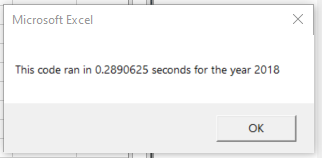

# Analyzing Stocks using VBA 

## Overview of Project

### The purpose of the analysis below is to help Steve examine the stocks of green energy companies. He contacted me to automate the analysis in an extension of Excel called VBA. After the initial code was written, it was refactored to run more efficiently for a larger amount of data. Examples of the refactored code and the results are explained below.

## Results

###  Within the data, there are 12 "tickers", or companies. The analysis called for a calculation of the Total Daily Volume and Return of the stocks of these companies. Total Daily Volume measures how actively a stock was traded. In other words, how many shares are traded per day? A stock's yearly return measures the percent increase or decrease in the price of a stock from the beginning and end of a given year. This tells you how much your investment grew of shrunk that year. These are the 2 analysis being run for the 12 companies as seen below.

 

Although the original code was functional, it was not as fast and efficient as it could be. Steve wanted to add more data which meant it would be even slower. 
The main difference between the original code and the refactored code is the organization of the loops. First, let us look at a piece of the original code below.

In this code we can see there is a nested loop. The loop that searches through the array of companies, or "tickers", holds the second loop inside of it. This means the computer first has to search through the tickers then loop through each row of data to satisfy the if statements within the second loop. The refactored code make this process more efficient by separating the loops. Let us look at the refactored code below.

In the refactored code, the loops are separated. We can see that arrays are created for the volume and the two prices needed to find the return. So, instead of running through the process 12 times to get the result of each company, the code runs them all simultaneously making for faster, smarter code.

##Summary

### Advantages or disadvantages of refactoring code:
- Advantage: Refactoring a code can help it run faster than before. 
- Advantage: Code that was difficult to read before can be cleaned and organized to make it easier for others to understand. This also means errors can be found and fixed easier.
- Advantage: There is also a chance that bad design that may have only worked for the current data, will be 

- Disadvantage: The code already works. This means a developer will have to set aside extra time toward something that is not in immediate need of a fix.
- Disadvantage: If done wrong, refactoring code can lead to more confusion or inaccurate outputs.

### How these pros and cons apply to refactoring the original VBA script:
- Pro: The code runs faster. Specifically, the time it took to run the original code for 2017 was 1.38 seconds and for 2018 was 1.35 seconds. Compare those numbers to the the ones for the refactored code below.

- Pro: Because the code runs all the tickers simultaneously rather than one at a time, it is more efficient and can run larger data sets as needed by Steve.

- Con: There was a big issue when rewriting the code. The first time it ran, it changed the numbers in my data causing all of my calculations to be wrong and the original code not to work anymore either. 
 
This was because I ran 
Cells(i, 6).Value = tickerStartingPrices(tickerIndex) 
instead of 
tickerStartingPrices(tickerIndex) = Cells(i, 6)

This is one of the dangers of rewriting code. If the data change had not been caught, Steve could have been working with the wrong numbers and the wrong code and not known it.
